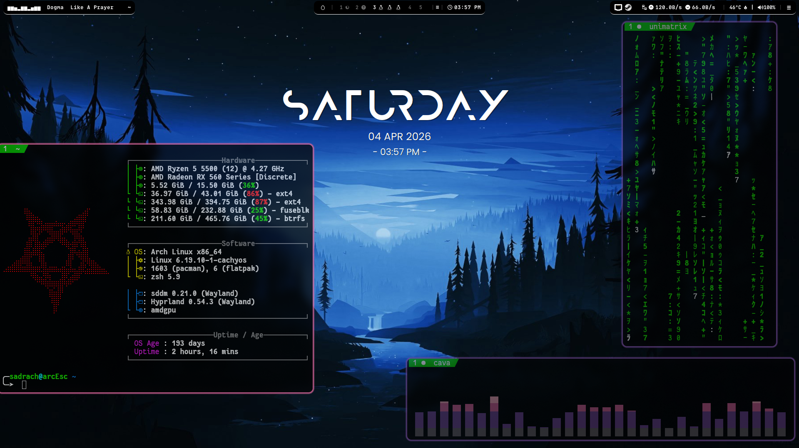
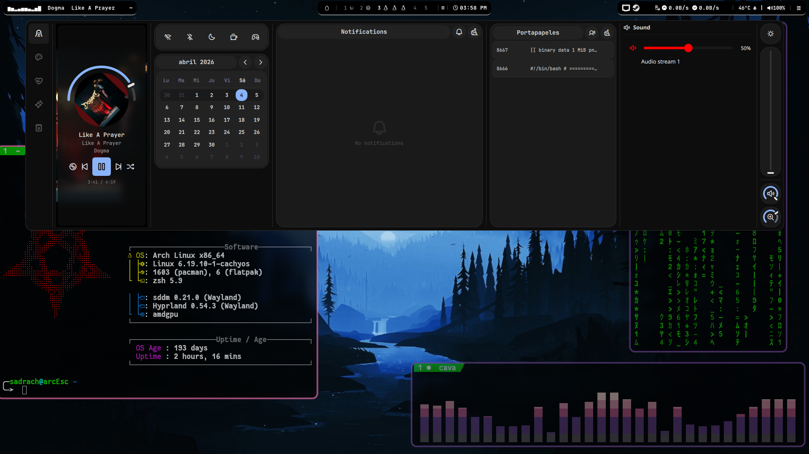
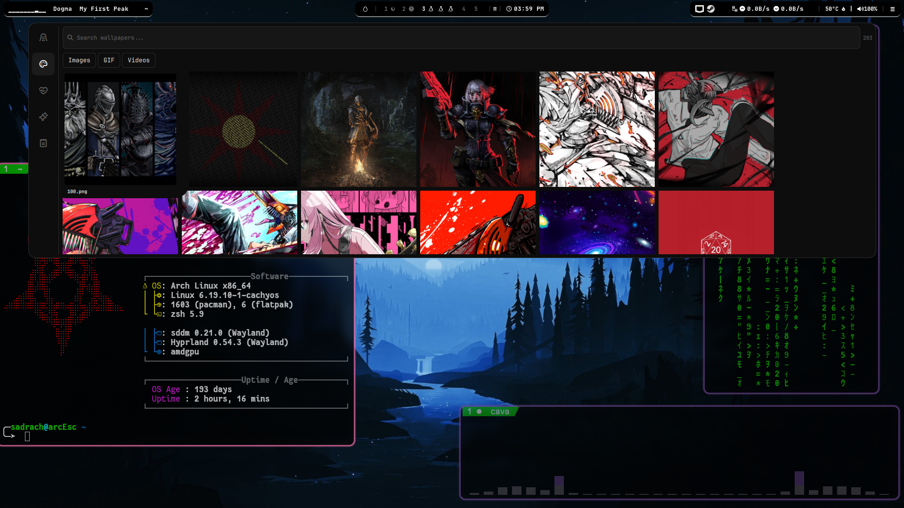
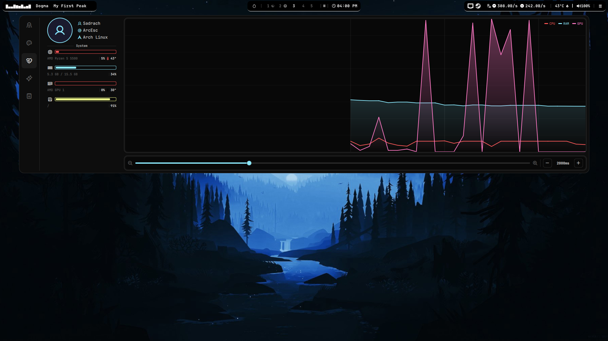
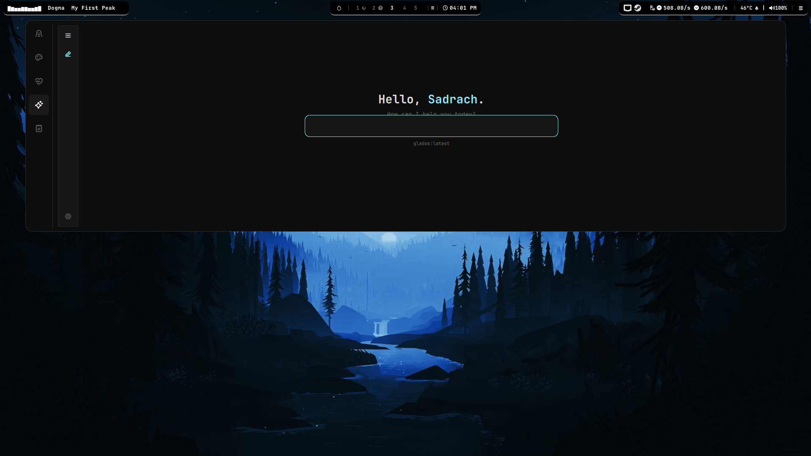
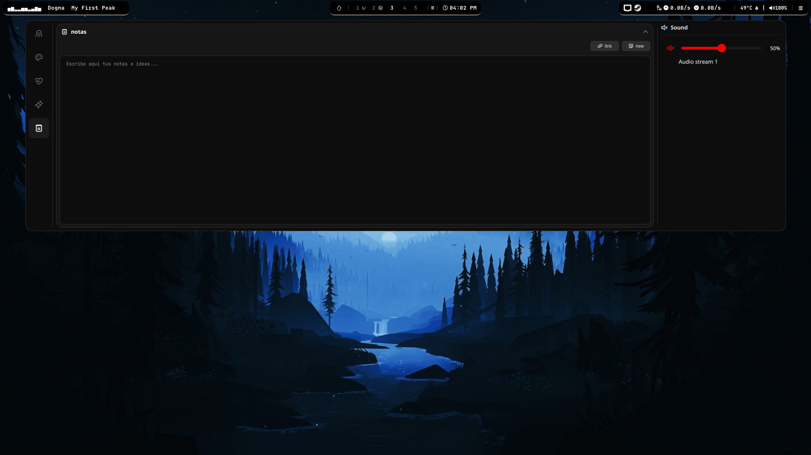
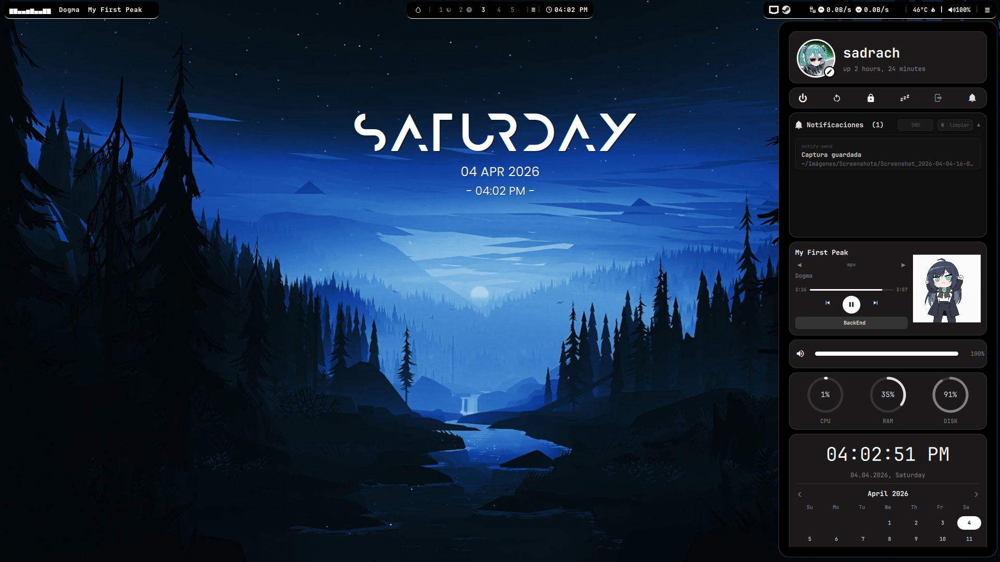
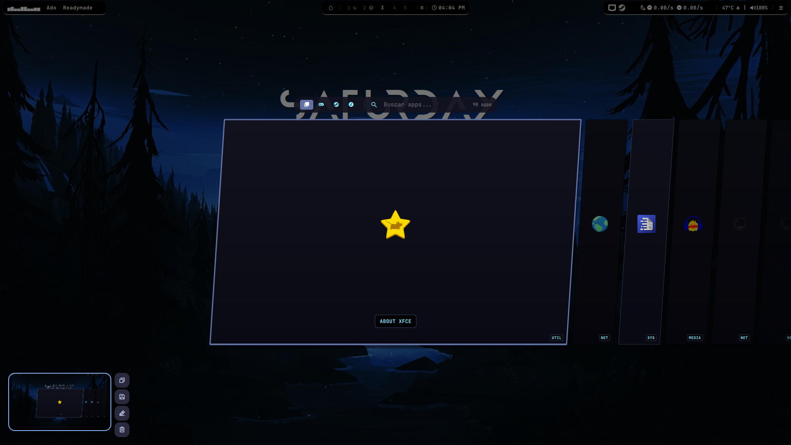
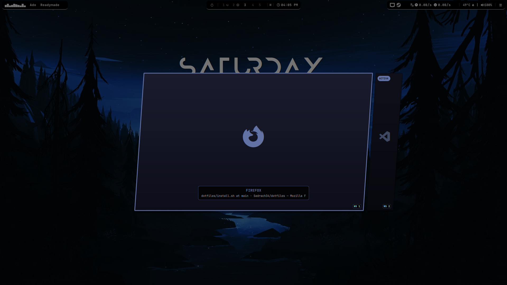
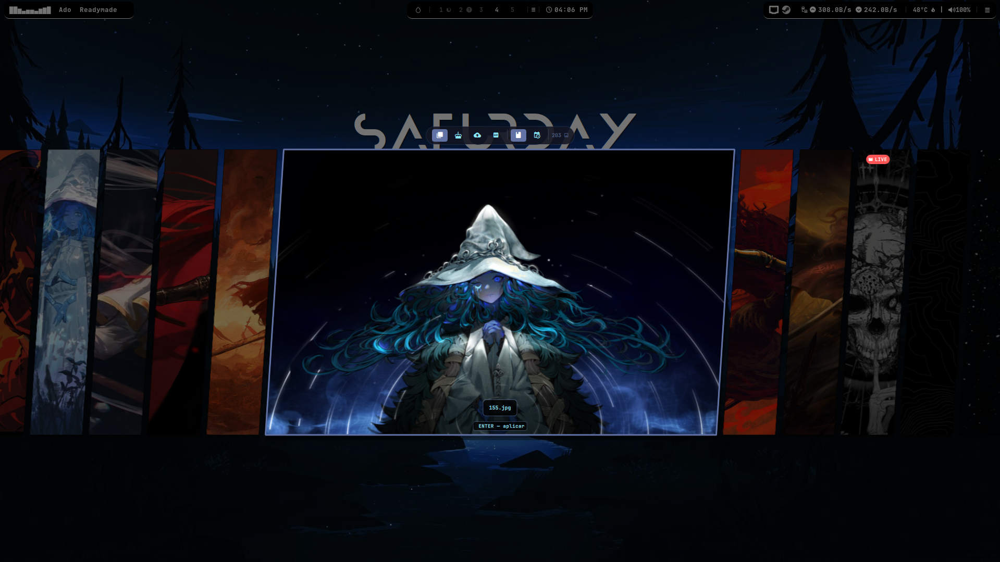

# Dotfiles de sadrach

Configuraciones personales para Hyprland, Quickshell, Waybar y entorno de terminal.

## Contenido

- `.config/hypr`: keybinds, scripts, arranque y flujo de wallpapers.
- `.config/quickshell`: paneles, launcher, dashboard, reloj y módulos personalizados.
- `.config/waybar`: módulos y acciones de integración con Quickshell.
- `.zshrc`: configuración de shell.
- `install.sh`: script de instalación base.
- `wallpapers/`: colección de fondos estáticos (sin animados).

## Wallpapers

Los fondos en `wallpapers/` incluyen solo formatos estáticos.

Formatos incluidos:

- `.jpg`, `.jpeg`, `.png`, `.webp`
- `.bmp`, `.tiff`, `.pnm`, `.tga`, `.farbfeld`

Formatos excluidos (animados):

- `.gif`, `.mp4`, `.mkv`, `.mov`, `.webm`, `.avi`

## Uso rápido

```bash
# clonar
git clone https://github.com/Sadrach34/dotfiles.git
cd dotfiles

# instalación inicial
bash install.sh --install

# actualización de una instalación existente
bash install.sh --update

# modo automático (instala o actualiza según estado)
bash install.sh
```

## Nota

Si quieres conservar también fondos animados, se pueden gestionar en una carpeta separada para evitar subir binarios pesados al repo principal.

El instalador ahora es reutilizable para cualquier PC y soporta flujo de actualización sin reinstalar todo desde cero.

## Capturas de pantalla

> Agrega aquí cómo se ve tu sistema (sección al final del README).

### Escritorio principal



### Top panel + dashboard








### App launcher




### Wallpaper picker


